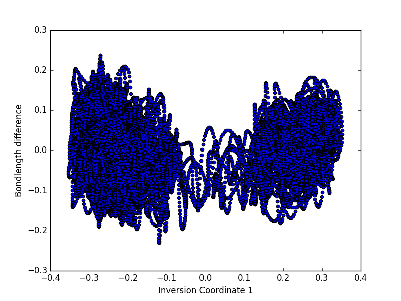
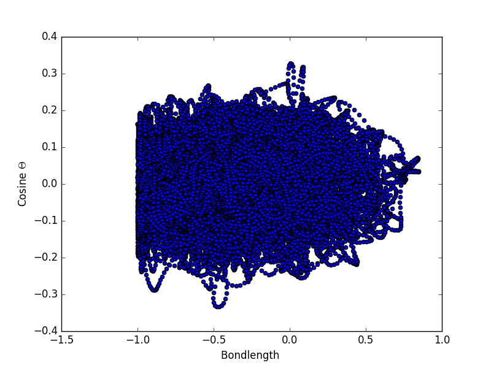

NB: Plotting is done by python

Trajectory files in data/ should have the format 'H20-pos-000.xyz'
The 3 characters before the dot indicates the temperature of caculation. Eg. H20-pos-050.xyz 

To run and plot data: make plot

## Table of plots

|  Eigen with DZVP |
Temp     |  Inversion Probability   |    Time series
:--------|:---------------:|:---------------:
   50    | | 
   100   | | 
   150   | | 
   300   | | 

|  Zundel Cation with DZVP |

	Temp |    Dot Product   | Inversion 1  | Inversion 2 
:--------|:----------------:|:------------:|:------------:
  50     | ||  
  100     | ||  
  150     | ||  
  300     | ||  

